# FILE MANIPULATION

- SUDO COMMAND

`sudo apt upgrade`

The sudo command short for "superuser do" is used in linux to perform tasks that require administrative or root permissions. This is the result below for using the sudo command:

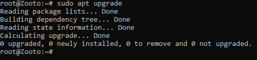

- PWD COMMAND

`pwd`

The pwd command is used to find the path of your current/present working directory. It has also has two acceptable options that can be used with it; -l which prints environment cariable content including symbol links, -P prints the actual path of the current directory.

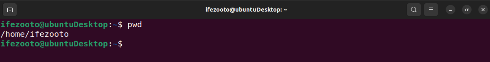

- CD COMMAND

`cd /home/ubuntu/CommandsLinux` or `cd CommandsLinux`

The cd command is used to navigate through folders/directories.

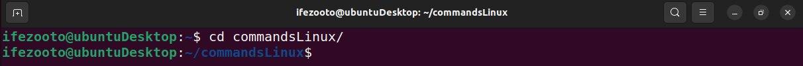

- LS COMMAND

`ls`

The ls command is used to list files and directories within a system. Running the command without a flag will only show the current working directory's content.

Here are some flags that can be used with the ls command:

`ls -R` : This lists all the files in the subdirectories.

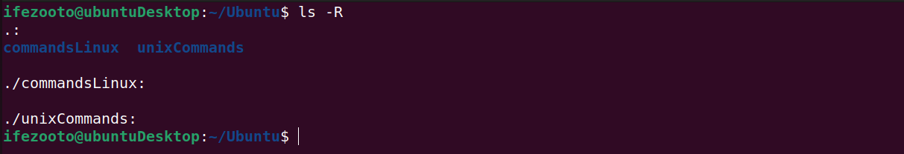

`ls -a` : This shows hidden files in addition to the visible ones.

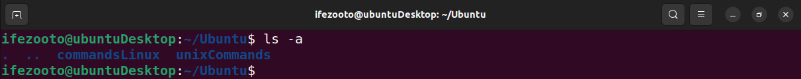

`ls -lh` : This shows file sizes in easily readable formats like KB, MB or GB.

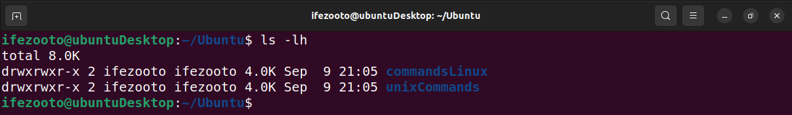

- CAT COMMAND

`cat filename`

The cat command is used to list, combine and write file contents to the standard output/terminal.

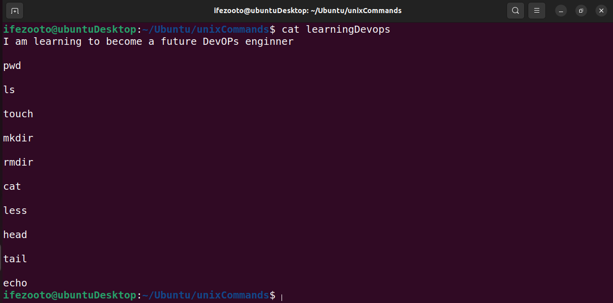

The `tac filename` can also be used but the contents are going to be displayed in reverse orders.

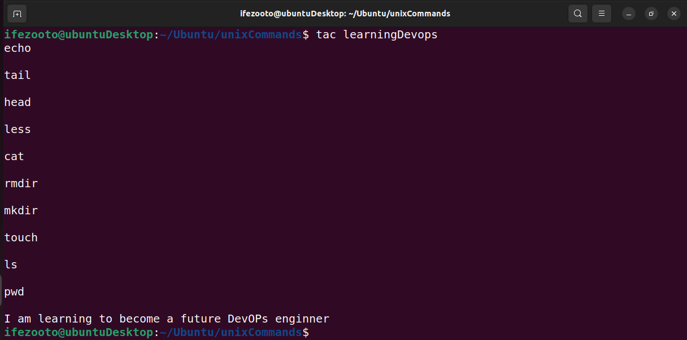

- CP COMMAND

`cp filename /destination_directory/`

The cp command is used to copy files or directories and their contents.

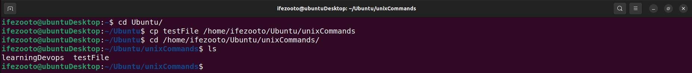

- MV COMMAND

`mv filename /destination_directory/`

The mv command on the other hand is either used for the purpose of moving a file or directory to another directory or used to rename a file.

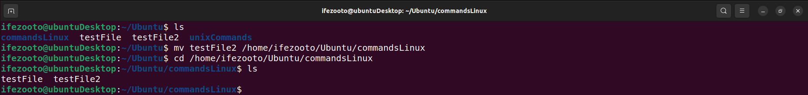

To rename a file, the command syntax should look like this;

`mv original_name file_rename`

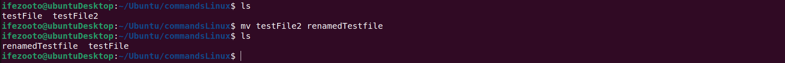

- MKDIR COMMAND

`mkdir [option/flag] directory_name`

The mkdir command is used to create one or multiple directories at once and set permissions for each of them.

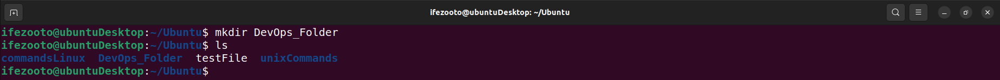

To create another directory in your already created directory, we use this syntax;

`mkdir parent_directory/new_directory`

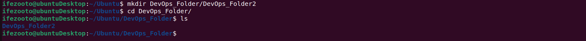

- RMDIR COMMAND

`rmdir -p /directory_name/`

The rmdir command, in the other hand is used to remove/permanently delete empty directory or directories.

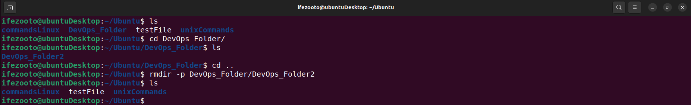

- RM COMMAND

`rm filename`

We use the rm command to remove files within a directory, and its action is not reversible. So we must take caution while in the use of the command.

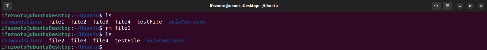

To remove multiple files at once, we use this syntax;

`rm filename1 filename2 filename3`

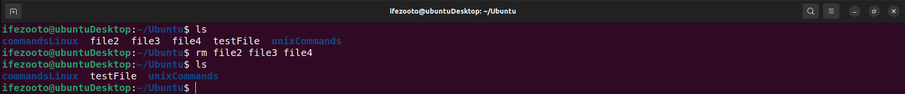

- TOUCH COMMAND

`touch filename`

The touch command is used to create new empty files.

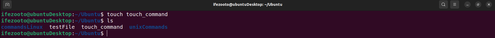

- LOCATE COMMAND

`locate -i filename1*filename2`

The locate command is used to locate a file in the database system. The -i arguement is used to turn off case sensitivity incase you don't remember the file's exact name, while the * is used to look for contents which conyains two or more words.

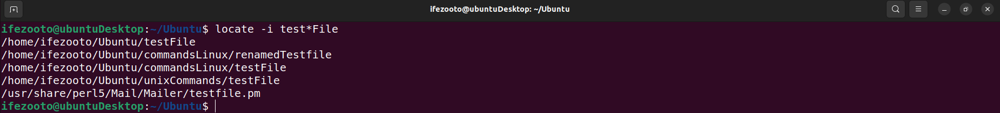

- FIND COMMAND

`find [option] [path] [expression]`

The find command is used to search for files within a specific directory and performs subsequent operations.

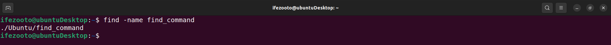

- DF COMMAND

`df [options] [file]`

The df command is used to report the system's disk space usage, the information is shown in percentage and kilobyte (KB).

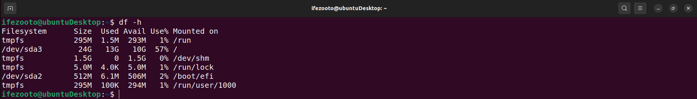

- DU COMMAND

`du directory_path`

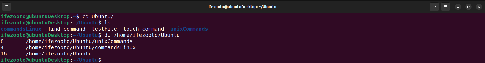

- HEAD COMMAND

`head [option] [file]`

The head command is used to view the first ten lines of a text file. Adding an option lets you change the number of lines shown.

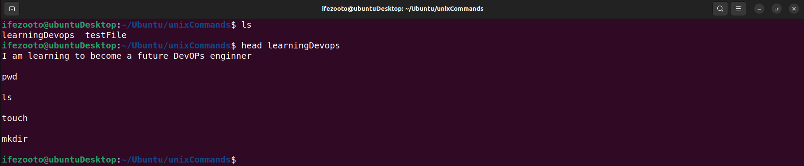

- TAIL COMMAND

`tail [option] [file]`

The tail command on the other hand is used to read the last ten lines of a text file. It allows users to check wether a file has new data or to read error messages.

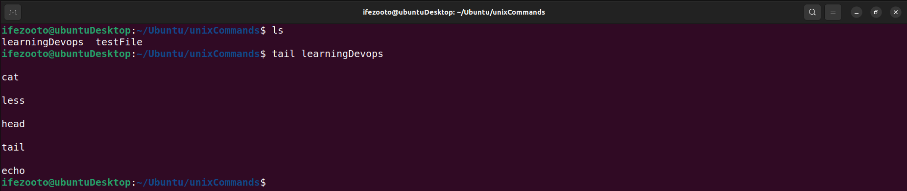

- DIFF COMMAND

`diff [option] file1 file2`

The diff command short for difference, is used to compare two contents of a file line by line. After analyzing them, it will display the parts that do not match.

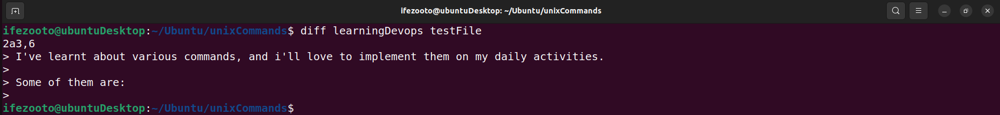

- TAR COMMAND

`tar [options] [archive_file] [file or directory to be archived]`

The tar command is used to archive multiple files into a tar file,which is a common linux format similar to the ZIP with optional compression

## FILE PERMISSIONS AND OWNERSHIPS

- CHMOD COMMAND

`chmod [option] [permission] [file_name]`

The chmod command is a command that modifies a file or directory's read, write and execute permissions.

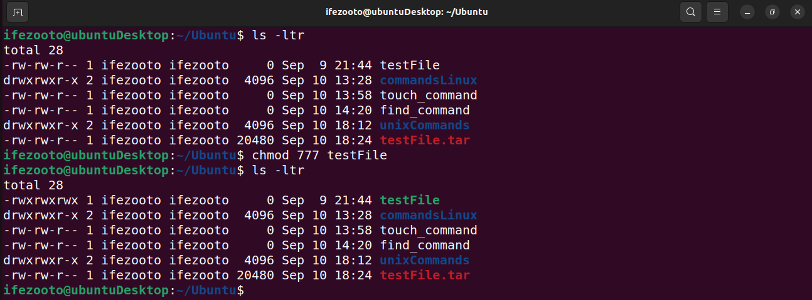

- CHOWN COMMAND

`chown [option] owner[:group] file(s)`

The chown command changes the ownership of files in Linux systems. The user can change their own ownership but not others' unless they have root privileges.

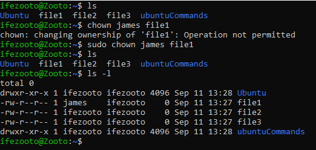

- JOBS COMMAND

`jobs [option] jobID`

The job command is used to display all the running processes along with their statuses.

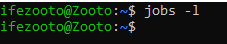

-KILL COMMAND

`kill [signal_option] PID`

The kill command is used to terminate an unresponsive program manually. It will signal misbehaving applications and instruct them to close their process.

 To kill a program using the above syntax, you must know its process identification number (PID). To know the PID of a program, we use the below command;

`ps ux`

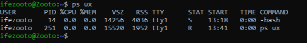

- PING COMMAND

`ping [option] [hostname_or_IP_address]`

The ping command is a basic linux command used for checking whether a network or service is reachable, and it is also used to troubleshoot various connectivity issues.

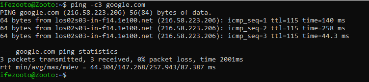

- WGET COMMAND

`wget [option] [url]`

The wget command lets you download files from the internet, it runs in the background without hindering other running processes.

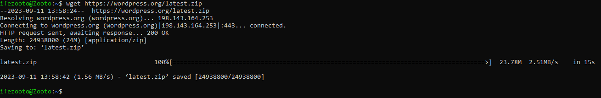

- UNAME COMMAND

`uname [option]`

The uname command or in full, unix name command will print detailed information and your linux system and hardware. The informations includes the machine name, operating system and kernel.

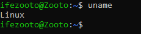

Some other useful options for more detailed informations are shown in the syntaxes below;

`uname -a`

This syntax prints all the system information.

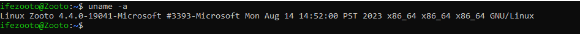

`uname -s`

This syntax prints the kernel name.

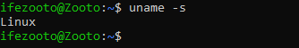

`uname -n`

This syntax prints the system's hostname.

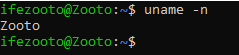

- TOP COMMAND

`top`

The top command in linux terminal will display all the running processes and a dynamic real-time view of the current system. It sums up the resource utilization, from the CPU to the memory usage.

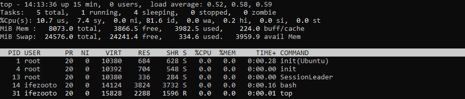

- HISTORY COMMAND

`history [option]`

The history command is used in linux to list up to 500 previously executed commands, allowing you to reuse them without re-entering them. However only users with the sudo privileges can execute this command.

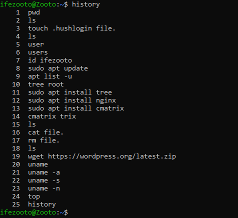

- MAN COMMAND

`man [command_name]`

The man command is used to display manual pages on your terminal screen, it can also be used as a search engine and help you find out what.

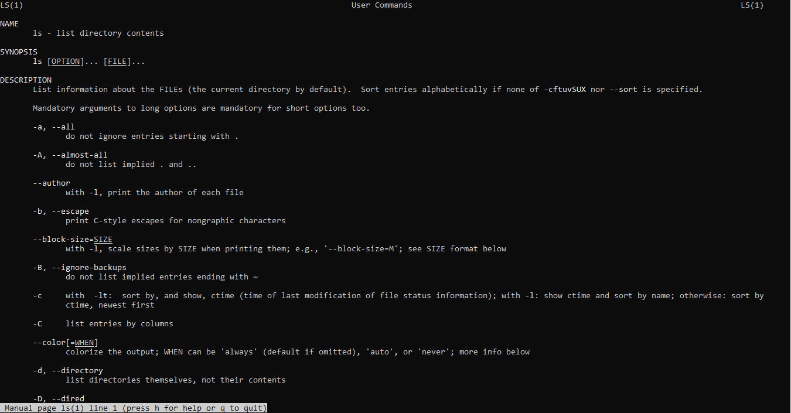

- ECHO COMMAND

`echo "string"` or `echo string > file`

The echo command is a built-in utility that displays a line of text or string using the standard output.

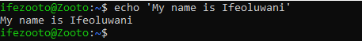

- ZIP, UNZIP COMMANDS

`zip [options] zipfile file1 file2….`

The zip command is used in linux to compress files into a ZIP file, a universal format commonly used in linux.

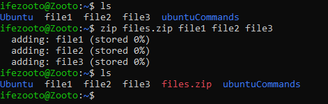

On the other hand, the unzip command extracts the zipped files from an archive. Here's the general syntax;

`unzip [option] file_name.zip`

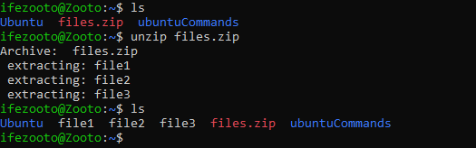

- HOSTNAME COMMAND

`hostname [option]`

This command prints out your system’s hostname (or domain name). The default behavior for this command without any options will print just one word.

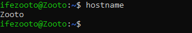

There are also other options to use for the command, but one of them is used to check for the ip address.

`hostname -i`

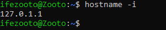

- USERADD, USERDEL COMMANDS

`useradd [option] username`

Useradd command is used to add new users to the system as linux is a multi-user system and only those with root/sudo privileges can run this command.

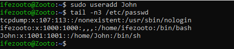

On the other hand, to delete a user account we use the userdel command;

`userdel [option] username`

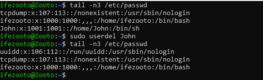

- APT-GET COMMAND

`apt-get [options] (command)`

Apt-get is a command line tool for handling Advanced Package Tool (APT) libraries in linux. It is used to retrieve information and bundles from authenticated sources to manage, update, remove and install software and its dependencies.

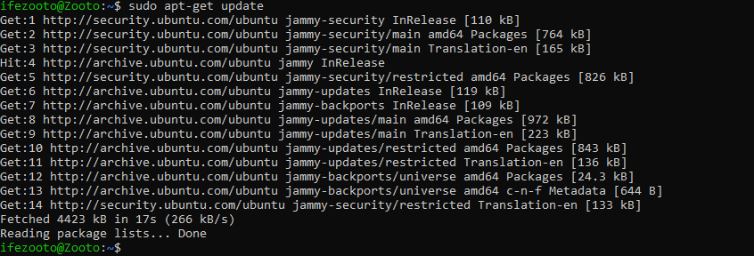

- NANO, VI AND JED COMMANDS

`nano [filename]`

The nano command is a basic text editor.

The vi command is used to edit and create a text file. It also performs other operations like saving, opening, copying and pasting a file. To use the vi command, we use this syntax;

`vi [filename]`

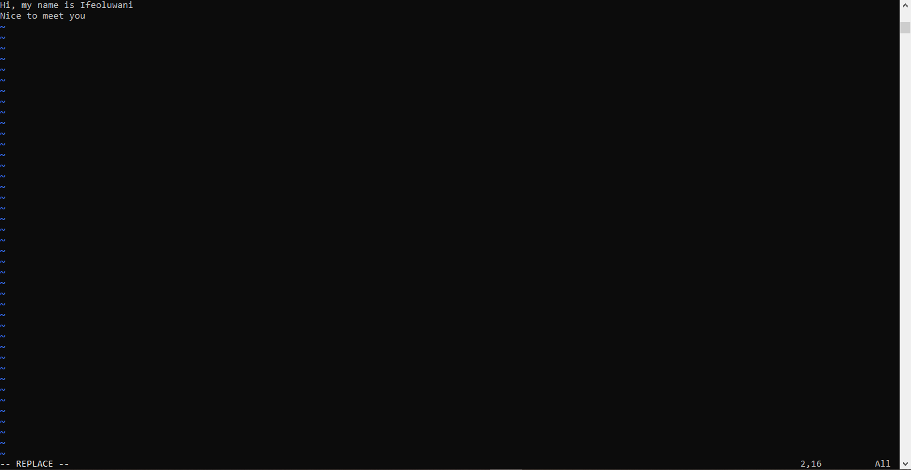

And finally jed command which stands for "Just Edit". It's basically vi command but it is known for its simplicity and extensibility. To use the jed command, we use this command syntax;

`jed [filename]`

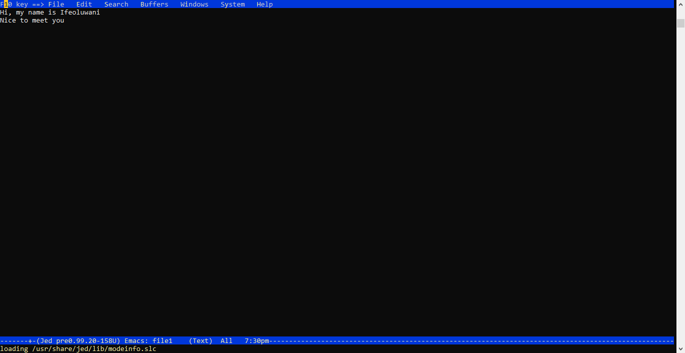

- ALIAS AND UNALIAS COMMAND

`alias Name=String`

The alias command will create an alias for any command that you want in your system.

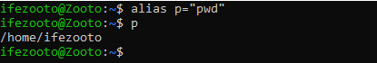

The unalias command on the other hand is used to delete an existing alias. Its syntax is;

`unalias [alias_name]`

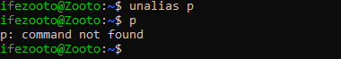

- SU COMMAND

`su [options] [username [argument]]`

The su command or switch user command is used to switch between existing users on the command line.

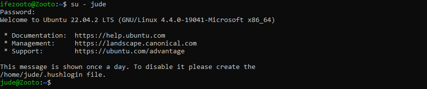

- HTOP COMMAND

`htop [options]`

The htop command is an interactive program that monitors system resources and server processes in real time.

- PS COMMAND

`ps`

The ps command or process status command produces a snapshot of all running processes in your system.

