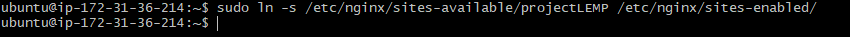
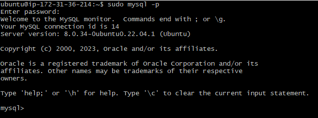

# WEB STACK IMPLEMENTATION [LEMP STACK]

## STEP 1 - INSTALLING THE NGINX SERVER

To install nginx, we use the apt package manager;

`sudo apt install nginx`

To confirm nginx was successfully installed and running as a service in Ubuntu, run;

`sudo systemctl status nginx`

Now, we have to check if we can access it locally on our Ubuntu shell using the coomand below;

`$ curl http://localhost:80` or `$ curl http://127.0.0.1:80`

We can also do the same on our web browser, by typing in the public address of our instance;

If the page above is displayed, then the web server is now correctly installed and accessible through the firewall.

## STEP 2 - INSTALLING MySQL

We use the apt package manager as well to install MySQL;

`sudo apt install mysql-server`

When the installation is finished, log in to the MySQL console by typing;

`sudo mysql`

Then we run a security script that removes insecure default settings and we will set a password for the root user before running the script. To set the password for the root user, we run the command below;

`ALTER USER 'root'@'localhost' IDENTIFIED WITH mysql_native_password BY 'PassWord.1';`

Then we exit the MySQL shell with the command below;

`mysql> exit`

After that, then we run the interactive script by running;

`sudo mysql_secure_installation`

When finished, then we test if we're able to log in to the MySQL console by running;

`sudo mysql -p`

To exit, type;

`mysql> exit`

## STEP 3 - INSTALLING PHP

We'll install `php-fpm` and `php-mysql` by using the apt package manager by running the command below;

`sudo apt install php-fpm php-mysql`

## STEP 4 - CONFIGURING NGINX TO USE PHP PROCESSOR

Before we start, we'll create the root web directory for your_domain as follow;

`sudo mkdir /var/www/projectLEMP`

Next, asign ownership of the directory by running;

`sudo chown -R $USER:$USER /var/www/projectLEMP`

Then we open a new configuration file in Nginx's `sites-available` directory by running this command;

`sudo nano /etc/nginx/sites-available/projectLEMP`

And pasting pasting in the below bare-bones configuration;

#/etc/nginx/sites-available/projectLEMP

server {
    listen 80;
    server_name projectLEMP <www.projectLEMP>;
    root /var/www/projectLEMP;

    index index.html index.htm index.php;

    location / {
        try_files $uri $uri/ =404;
    }

    location ~ \.php$ {
        include snippets/fastcgi-php.conf;
        fastcgi_pass unix:/var/run/php/php8.1-fpm.sock;
     }

    location ~ /\.ht {
        deny all;
    }

}

After that, then we'll activate our configuration by linking to the config file from Nginx's `sites-enabled` directory by running the command below;

`sudo ln -s /etc/nginx/sites-available/projectLEMP /etc/nginx/sites-enabled/`

Then we test our configuration for any syntax errors by typing;

`sudo nginx -t`

Then we also need to disable default Nginx host that is currently configured to listen on port 80, for this run the command below;

`sudo unlink /etc/nginx/sites-enabled/default`

We reload NGINX to apply these changes and then check that everything is working correctly with:

`sudo systemctl reload nginx`

Now, we'll create index.html file in the /var/www/projectLEMP directory so as to test that our new server block works as expected and pasting the following;

`sudo echo 'Hello LEMP from hostname' $(curl -s http://169.254.169.254/latest/meta-data/public-hostname) 'with public IP' $(curl -s http://169.254.169.254/latest/meta-data/public-ipv4) > /var/www/projectLEMP/index.html`

Then go to the browser open our website URL using its IP address and the text below will be displayed;

## STEP 5 - TESTING PHP WITH NGINX

We can do this by creating a test PHP file in document root by running;

`nano /var/www/projectLEMP/info.php`

Add the following lines into it:

`<?php
phpinfo();`

Then we can access the page in the browser by visiting the public address followed by `/info.php`. Then a web page containing detailed information about the server will be displayed;

After checking the relevant information about the PHP server through that page, it is best to remove the file created as it contains sensitive informations, to do that run;

`sudo rm /var/www/your_domain/info.php`

## STEP 6 - RETRIEVING DATA FROM MySQL DATABASE WITH PHP

Firstly, connect to the MySQL console using the root account by running;

`sudo mysql -p`

Then we create a new database, by running;

`CREATE DATABASE`example_database`;`

Next, we create a new user and grant him full privileges on the database just created and password. To do so, run;

`CREATE USER 'example_user'@'%' IDENTIFIED WITH mysql_native_password BY 'PassWord.1';`

Now, we need to give the newly created user permission over the database by running the command below;

`mysql> GRANT ALL ON example_database.* TO 'example_user'@'%';`

Then we exit the console by running;

`exit`

Then we test if the new user has proper permissions by using the command below;

`mysql -u example_user -p`

Now, we'll create a table named **todo_list** by runing the command below;

`CREATE TABLE example_database.todo_list (item_id INT AUTO_INCREMENT,content VARCHAR(255),PRIMARY KEY(item_id));`

After creating the table, we might want to add a few rows in the test table by running this command and repeating it with different values;

`INSERT INTO example_database.todo_list (content) VALUES ("My first important item");`

To confirm that the data was successfully saved to the table, run;

`SELECT * FROM example_database.todo_list;`

After confirming, to exit the console, run;

`exit`

Now we can create a PHP script that will connect to MySQL and query for our content and pasting the below content into the todo_list.php by running;

`nano /var/www/projectLEMP/todo_list.php`

Then we can access the page in our web browser by pasting the public IP address followed by `/todo_list.php`

<<<<<<< HEAD

=======

>>>>>>> d8b05d710ed71ad4764c65e6576d90aab494a0c8
